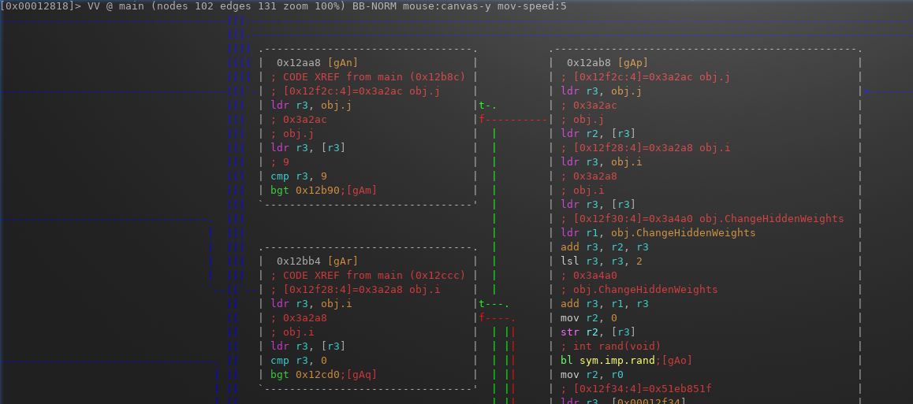

# IoT-Forensics-demo
Proof-of-concept demonstration of IoT forensics approach to analyse data from smart application

## Description
We investigate digital forensics readiness of interconnected devices in the Edge, rather than of a stand-alone device. The focus is on the open-source platforms to create a corresponding road map for the investigative process along with recommendations. In particular, it was (i) created a Smart Application (environment sensors control) scenario with Edge devices involving IoT hub (Raspberry Pi) and IoT end-point devices (Arduino Uno and ESP8266), (ii) performed step-by-step collection of the artefacts in accordance to Digital Forensics Process and (iii) analysis of the acquired digital evidences from interconnected Edge devices using open-source existing tools. A special focus will be given to understanding and reverse-engineering ML/AI software found along with raw data on IoT devices' storage, considering omnipresence of such software in IoT appliances. 


## Computer Forensics Investigation in the Edge 
Below the short description of used methodlogy is given

### Field work and Acquisition
A person, who deals with the Smart Application setup, needs to clearly identify used components, sensors, actuators, connectivity and possible information flow and anticipated logic of the system. The picture of the aforementioned setup is shown in the figure below. In this case, all the devices have labels and distinct logos, making them easy to identify and reveal capabilities and technical characteristics.


### Live device on-chip access via JTAG / ISP / TTL
Arduino has serial communication available, it is possible to connect to the terminal and observe actual communication. From this, it is understandable that MCU is trying to establish MQTT communication and receives data from another component, also successfully identifying some given input pattern. Further, Raspberry Pi board has UART communication, which can be accessed through USB to TTL adapter by connecting TX/RX/GND pins to board pins 6,8 and 10 respectively. Access SoC via UART is given via Linux terminal: 
```bash
$ sudo chmod 666 /dev/ttyUSB1; 
$ screen /dev/ttyUSB1 115200
```

### Live acquisition of the network traffic
One of the important sources for digital evidential data is network communication within the given IoT infrastructure. To acquire necessary data and technical details, we used Address Resolution Protocol (ARP) Spoofing approach with a help of EtterCAP tool that allows sniffing of a stitched network. The result of the program execution is shown in the figure below.

From EtterCAP we note two important issues: there are two devices with IP addressed 192.168.0.100, 192.168.0.200 that have regular MQTT communication transferring weights (parameters) of the Artificial Neural Network.


### IoT node artifacts
n our setup, we utilize Avrdude tool with Arduino as AVR  in-system programming technique (ISP) to retrieve the data to dump the content of the memory on Arduino Uno.
```bash 
$ avrdude -P /dev/ttyUSB0 -F -v -v -c arduino -pm328 -D -Uflash:r:arduino_dump.hex:r
$ md5sum
	219de396b61bd3feefc064295fa53828  arduino_dump.hex
$ls -la
	-rw-rw-r-- 1  32652 nov.  21 12:17 arduino_dump.hex
```

### IoT hub/gateway artifacts
```bash
$ fdisk -l
Disk /dev/mmcblk0: 14,9 GiB, 15931539456 bytes, 31116288 sectors
Units: sectors of 1 * 512 = 512 bytes
Sector size (logical/physical): 512 bytes / 512 bytes
I/O size (minimum/optimal): 512 bytes / 512 bytes
Disklabel type: dos
Disk identifier: 0x41503d89

Device         Boot  Start      End  Sectors  Size Id Type
/dev/mmcblk0p1        8192   532480   524289  256M  c W95 FAT32 (LBA)
/dev/mmcblk0p2      540672 31116287 30575616 14,6G 83 Linux

$ sudo umount /dev/mmcblk0
$ sudo dd if=/dev/mmcblk0 of=~/sd-card-copy.img
31116288+0 oppfoeringer inn
31116288+0 oppfoeringer ut
15931539456 byte (16 GB), 15 GiB kopiert, 247,108 s, 64,5 MB/s
$ md5sum sd-card-copy.img
93aef0ff0432a512e498153576221ccf  sd-card-copy.img
```

### Machine Learning Component Analysis
As mentioned before, any ML application program use data to train a specific model use for further decision making in Smart Applications. The report is extracted using SleuthKit and shown in the listing below.

```bash 
$ file /2/home/pi/mqtt_ml/ArduinoANN_training_RaspberryPi/a.out
File Type: ELF 32-bit LSB shared object, ARM, EABI5 version 1 (GNU/Linux), dynamically linked, interpreter /lib/ld-, for GNU/Linux 3.2.0, BuildID[sha1]=d70d380be66d6e2b6544802dd745707db2834430, not stripped
```
To understand the functionality we can either use commercial IDA Pro or free cross-platform tool Radare2, as depicted below.

```bash
$ radare2 -aarm ./a.out
> aaa
> s main
> VVV
```


 
## IoT setup 
For the demonstration purpose, we model a core architecture of the Smart Home, also found in other domains - intelligent monitoring with a feedback loop. An imaginary scenario was developed inspired by MEML (Shalaginov et al. 2019), where the IoT node uses the ML model trained on the IoT gateway to protect against cyber attacks. The diagram of the experimental installation shown in the figure below.


## Requirements
- Raspberry Pi 3 B (16 Gbytes microSD card), IP address 192.168.0.200
- Arduino Uno (microcontroller ATmega328P, Flash 32Kbytes, RAM 2 KBytes, EEPROM 1 Kbyte), IP address 192.168.0.100
- ENC28J60 Ethernet controller for Arduino
- 5 ports 10/100 Fast Ethernet Switch
- TTL USB convertor PL2303HX 


## Original Paper
You can find more information about the practical experiments and datasets in the following conference paper:

	@INPROCEEDINGS{shalaginov2020iot,
		title={IoT Digital Forensics Readiness in the Edge: A Roadmap for Acquiring Digital Evidences from Intelligent Smart Applications},
		author={Shalaginov, Andrii and Iqbal, Asif and Olegård, Johannes},
		booktitle={Proceedings of the International Conference on Edge Computing (EDGE) },
		year={2020}
	}

## Misc
Uploaded files:
- arduino_dump.hex - dump of the firmware from the IoT node
